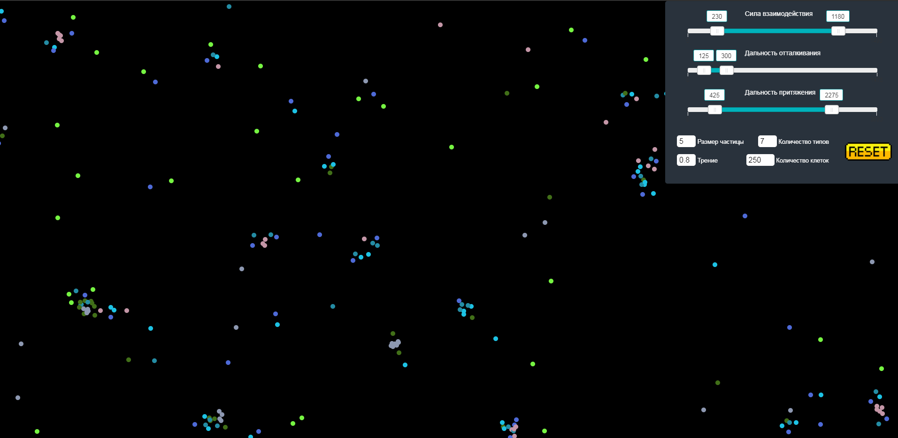

# Particle_life

Симуляция взаимодействия частиц, аналог клеточного автомата.

Правила:
+ Существует несколько типов частиц
+ Частицы каждого типа притягиваются к частицам других типов с разной силой
+ При достижении определенного расстояния, клетки начинают отталкиваться

[Потрогать тут](https://megachell0.github.io/Particle_life/)

